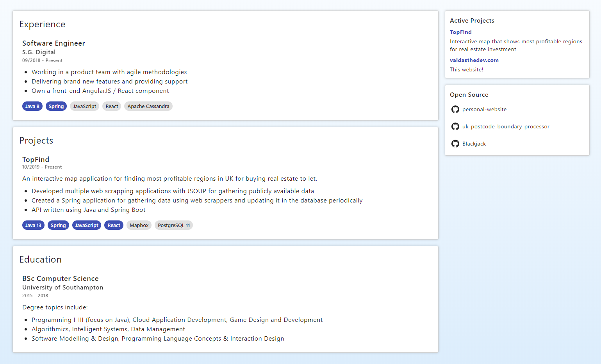
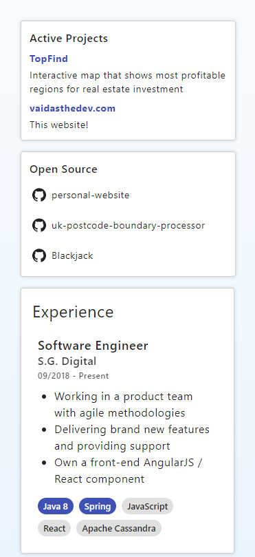

# Personal Website 1

React-based DB-free personal website application. Add your data, build and deploy.

- Mobile friendly

## How it works

Since the application is DB-free, the data is loaded from populated constants stored in `data` directory.

Components are auto-generated with the data you provide.

## Preview

Preview of the look on computer and mobile screens, respectively.

### Computer

  

  

### Mobile

  

  

## External dependencies
| Library             | Version   |
|---------------------|-----------|
| Material UI Core    | v4.9.5    |
| Material UI Icons   | v4.9.1    |
| React               | v16.13    |
| React SVG           | v11.0.14  |
| React Device Detect | v1.11.14  |

## License
Open license.

**Note**: licenses from external dependencies apply.
